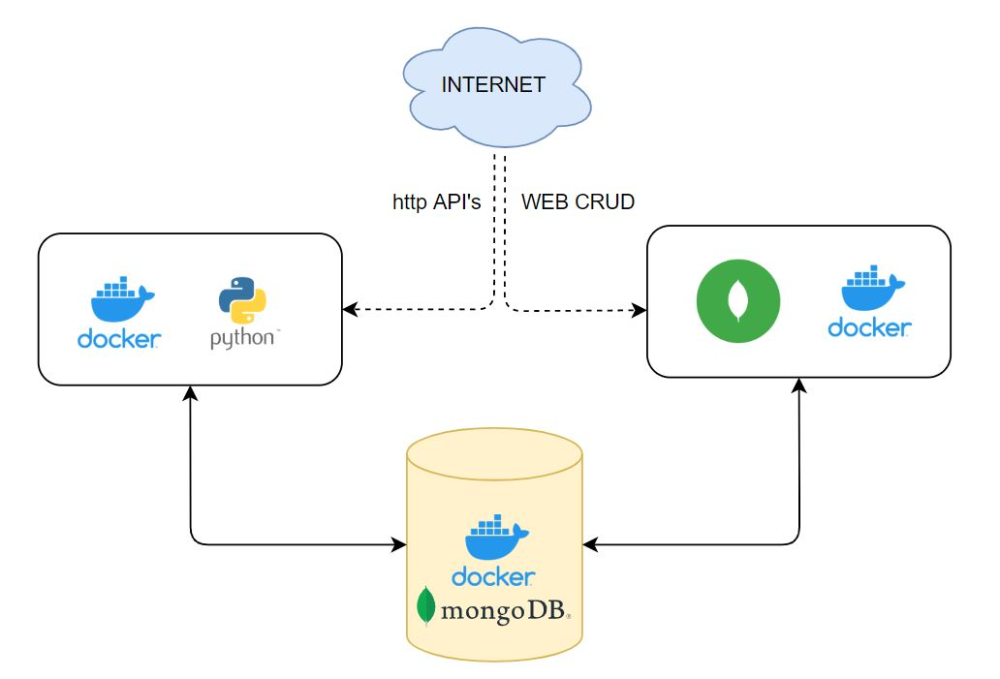

## Features

- Using PyMongo library and flask, the python container acts as a gateway between the internet and the MongoDB instance
- Creates a database with the name - mydatabase and also creates a collection with the name - names under it 
- HTTP Methodologies supported - GET, POST, DELETE 
- For instance, mongo-express is also provided. The same can be used if needed (Just in case)

## REST API Endpoints

| PATH | PURPOSE | Method |
| ------ | ------ | ------ |
| /api/v1/database/fetch | Fetches all the documents from the collection | GET |
| /api/v1/database/insert | Inserts data (from the arguments) in the collection | POST |
| /api/v1/database/delete | Deletes the documents corresponding to the arguments | DELETE |

## Prequisites

- docker 
- docker-compose
- Requested ports to be opened from the firewall
